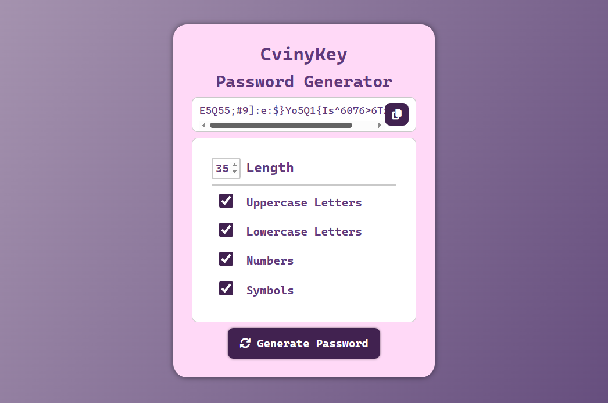

# 🔐 Password Generator - CvinyKey 🔐
A customizable and responsive password generator.
The project allows users to define password characteristics like length, letters, numbers, and symbols — and soon, it will support **clipboard copy**, **user login**, and **password history**.

## 📸 Work-in-progress preview

## ✨ Features

- ⚙️ Define password **length**
- ⚙️ Include **uppercase** and/or **lowercase** letters
- ⚙️ Include **numbers**
- ⚙️ Include **symbols**
- 🛠️ Copy to clipboard functionality *(coming soon)*
- 🌙 Dark mode *(coming soon)*
- 🧩 User authentication system *(coming soon)*
- 🧩 Save previously generated passwords per user *(coming soon)*

---

## 🛠️ Tools Used or to be used

  

---

### 🛠️ Status
**Work in Progress** `⚙️`  
> Currently focused on styling and layout. JavaScript logic, clipboard support and Back-end will be implemented next.

## 💡 Goals
✅ = Finished | ⚙️ = In progress

- ✅ Organize and centralize the layout with clean structure   
- ✅ Build a modern and responsive UI using CSS
- ✅ Implement customizable password settings (length, symbols, etc.)  
- ⚙️ Add password generation logic  
- ⚙️ Clipboard copy function  
- ✅ Mobile responsiveness
- ⚙️ Add user authentication system *(planned)*  
- ⚙️ Store generated/copied passwords per user *(planned)*  
- ⚙️ Add dark mode and improve accessibility *(planned)*

---

Made with ❤️ by Lorena Araujo (Corviny)
